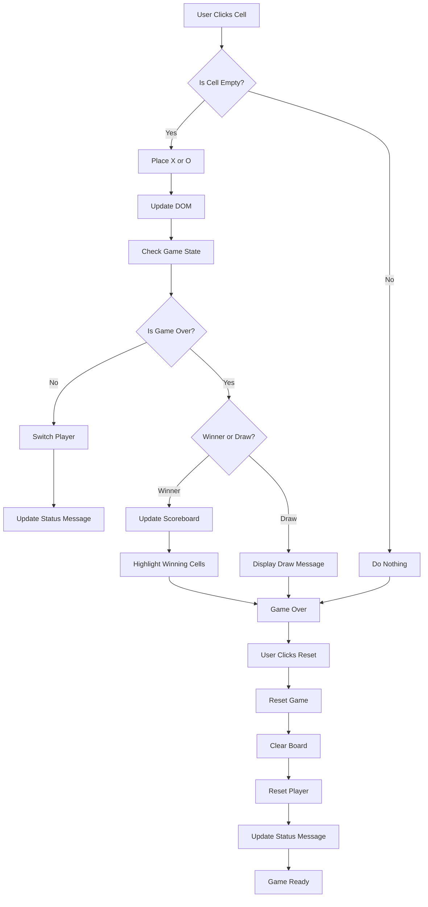

# Tic-Tac-Toe Project

This project is a simple Tic-Tac-Toe game built using HTML, Tailwind CSS, and jQuery. It is a simple example of a project that was generated using AI Coding Agent, in this case, Roo, a VS Code extension.

## Prerequisites

Before you begin, ensure you have met the following requirements:
- You have a web browser installed (e.g., Chrome, Firefox).
- You have internet access to load the Tailwind CSS and jQuery CDNs.

## Installation

To set up the project locally, follow these steps:

1. Clone the repository to your local machine:
    ```sh
    git clone <repository-url>
    ```

2. Navigate to the project directory:
    ```sh
    cd /c:/dev/poc/ai-demo-1
    ```

3. Open `index.html` in your web browser to view and interact with the Tic-Tac-Toe game.

## Project Structure

The project consists of the following files:
- `index.html`: The main HTML file that includes the game structure and references to Tailwind CSS and jQuery.
- `app.js`: The main JavaScript file containing the game logic and event handlers.
- `prompts.md`: A markdown file with step-by-step prompts for building the project incrementally. This file was inspired by a blog post by Harper Reed, which can be found [here](https://harper.blog/2025/02/16/my-llm-codegen-workflow-atm/).

## Usage

- Open `index.html` in a web browser to start the game.
- Click on the cells to place X or O.
- The game will automatically detect wins and draws.
- Use the "Reset Game" button to start a new game while keeping the scores.

## Code Flow Diagram

Below is a Mermaid diagram explaining the code flow of the Tic-Tac-Toe project:



## License

This project is licensed under the MIT License.
